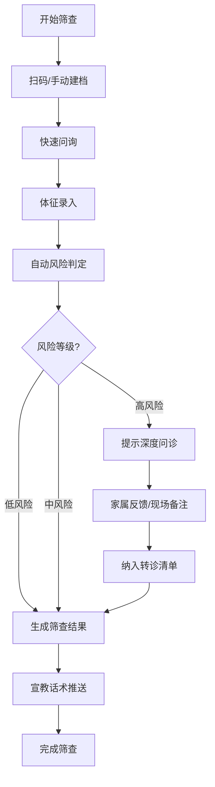

## 1. 产品概述

社区睡眠呼吸暂停初筛平板工作台，面向社区体检点护士和健康管理师，用于团体义诊、入户随访和老年活动日中快速完成睡眠呼吸暂停（OSA）初筛。通过标准化问卷和体征采集，实现一致、可追溯的风险判定，提升基层筛查效率。

## 2. 核心功能

### 2.1 用户角色

| 角色 | 使用场景 | 核心权限 |
|------|----------|----------|
| 护士/健康管理师 | 团体义诊、入户随访、老年活动日 | 筛查操作、数据录入、结果查看、转诊管理 |
| 管理员 | 社区卫生服务中心 | 数据统计、话术管理、批次管理 |

### 2.2 功能模块

1. **扫码建档**：扫描身份证/健康码快速建档，支持手动输入
2. **快速问询**：打鼾频率、夜间憋醒、白天嗜睡等标准化问卷
3. **体征录入**：年龄、体重、血压、颈围等体格指标采集
4. **风险判定**：多维度加权评分，自动判定低/中/高风险
5. **转诊清单**：高危人群自动纳入转诊，跟踪转诊状态
6. **统计管理**：批次管理、高危比例统计、数据导出

### 2.3 页面详情

| 页面名称 | 模块名称 | 功能描述 |
|----------|----------|----------|
| 首页/工作台 | 场次概览 | 显示当前场次信息、今日筛查数、高危人数、完成进度 |
| 首页/工作台 | 快捷入口 | 扫码建档、批量导入、未筛名单、已筛名单、转诊清单 |
| 扫码建档 | 扫码录入 | 摄像头扫码识别身份证信息，自动填充档案 |
| 扫码建档 | 手动建档 | 姓名、性别、年龄、身份证号、联系电话、地址 |
| 快速问询 | 症状问卷 | 打鼾频率、夜间憋醒次数、白天嗜睡程度、既往病史 |
| 体征录入 | 体格指标 | 身高、体重、BMI、血压、颈围、腰围 |
| 风险判定 | 评分展示 | 各项得分明细、总分、风险等级（低/中/高） |
| 风险判定 | 深度问诊 | 高危人群自动提示加做深度问诊，家属反馈、现场备注 |
| 风险判定 | 结果生成 | 一页式筛查结果，可打印/分享 |
| 转诊清单 | 转诊列表 | 高危人员列表，转诊状态、转诊医院、随访记录 |
| 统计中心 | 场次统计 | 各场次筛查人数、高危比例、完成率 |
| 统计中心 | 数据导出 | 批量导出当天/指定批次数据 |
| 宣教话术 | 话术库 | 标准化宣教话术，分类管理、快速调用 |

## 3. 核心流程

筛查主流程：建档 → 快速问询 → 体征录入 → 风险判定 →（高危）深度问诊 → 生成结果 → 转诊/宣教

## 4. 用户界面设计

### 4.1 设计风格
- **主色调**：医疗蓝（#1677ff），代表专业和信任
- **辅助色**：健康绿（#52c41a）、警告橙（#faad14）、危险红（#ff4d4f）
- **中性色**：深灰 #1f2937、中灰 #6b7280、浅灰 #f3f4f6
- **设计风格**：扁平化卡片式布局，大触控区域，适合平板操作
- **字体**：清晰易读的无衬线字体，大字号为主
- **按钮**：圆角大按钮，明确的视觉反馈，触摸友好
- **动效**：简洁的过渡动画，步骤指示器清晰

### 4.2 页面设计概览

| 页面名称 | 模块名称 | UI元素 |
|----------|----------|--------|
| 工作台 | 顶部栏 | 场次名称、日期、返回、设置 |
| 工作台 | 数据卡片 | 筛查总数、高危人数、完成率、待转诊数 |
| 工作台 | 快捷操作 | 6个功能入口，图标+文字 |
| 扫码建档 | 扫描区 | 摄像头预览框、扫描动画 |
| 扫码建档 | 表单区 | 个人信息表单，大输入框 |
| 快速问询 | 问题卡片 | 每题一张卡片，单选/评分选项 |
| 快速问询 | 进度条 | 顶部显示答题进度 |
| 体征录入 | 数值输入 | 身高/体重/血压等，带单位 |
| 体征录入 | 自动计算 | BMI自动计算显示 |
| 风险判定 | 仪表盘 | 总分和风险等级可视化 |
| 风险判定 | 得分明细 | 各项指标得分条 |
| 转诊清单 | 列表 | 人员卡片，标签显示状态 |
| 统计中心 | 图表 | 柱状图/饼图展示统计数据 |

### 4.3 响应式
- **平板优先**：以1024px平板横屏为主要设计尺寸
- **触摸优化**：按钮最小高度48px，间距充足
- **横竖屏适配**：支持横竖屏切换，布局自适应
- **大字体**：基础字号16px，重要信息18-20px

### 4.4 交互体验
- 步骤导航清晰，支持前进后退
- 表单自动保存，防止数据丢失
- 高危结果醒目提醒，彩色标识
- 一键生成结果，支持分享打印
