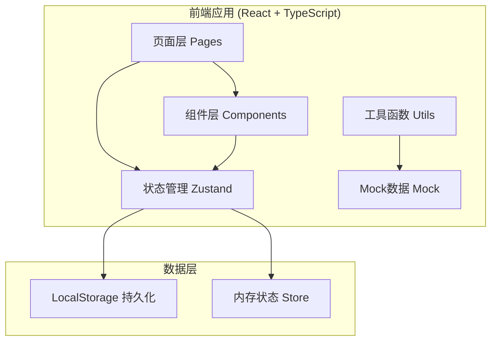
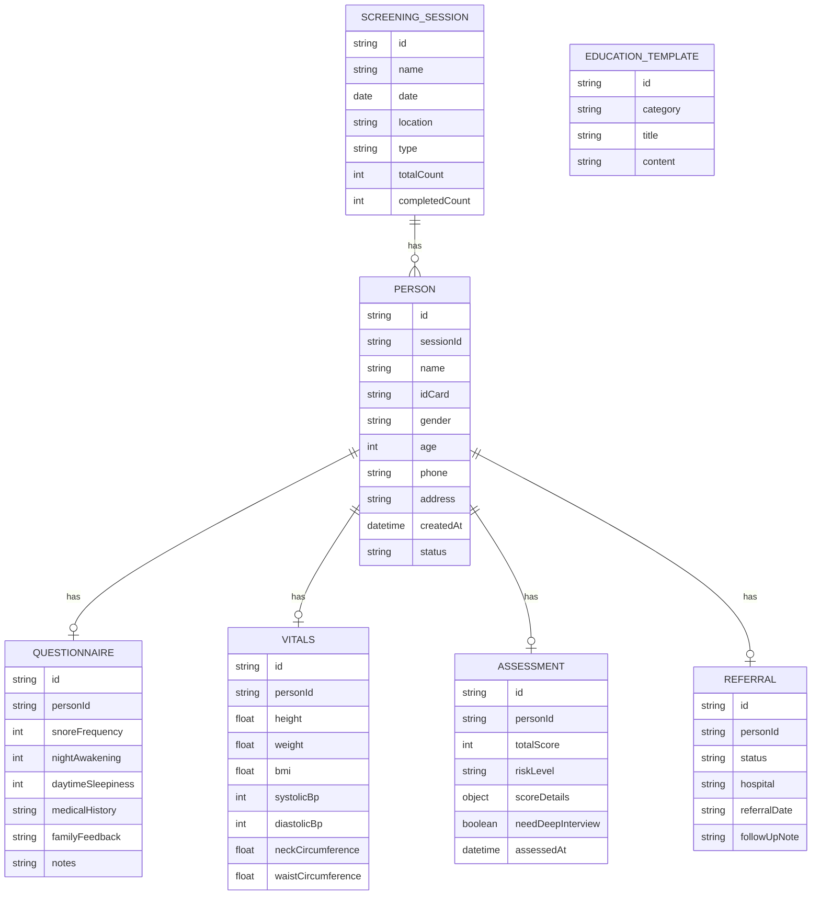

## 1. 架构设计



## 2. 技术描述

- **前端框架**：React@18 + TypeScript
- **构建工具**：Vite@5
- **样式方案**：TailwindCSS@3
- **状态管理**：Zustand
- **路由管理**：React Router DOM@6
- **图标库**：Lucide React
- **图表库**：Recharts
- **数据持久化**：LocalStorage
- **UI组件**：自定义组件 + Tailwind 样式

## 3. 路由定义

| 路由 | 页面 | 说明 |
|------|------|------|
| / | 工作台首页 | 数据概览、快捷入口 |
| /registration | 扫码建档 | 人员档案录入 |
| /questionnaire | 快速问询 | 症状问卷填写 |
| /vitals | 体征录入 | 体格指标采集 |
| /assessment | 风险判定 | 评分结果展示 |
| /referral | 转诊清单 | 转诊人员管理 |
| /statistics | 统计中心 | 数据统计和导出 |
| /education | 宣教话术 | 标准化话术库 |
| /screening/:id | 筛查详情 | 单人完整筛查流程 |

## 4. 数据模型

### 4.1 数据模型定义



### 4.2 评分规则

睡眠呼吸暂停风险评分（简化版STOP-Bang + 颈围等指标）：

| 维度 | 评分项 | 分值 |
|------|--------|------|
| 年龄 | ≥50岁 | 1分 |
| 性别 | 男性 | 1分 |
| BMI | ≥28 | 1分 |
| 颈围 | 男性≥40cm，女性≥36cm | 1分 |
| 打鼾 | 经常打鼾 | 1分 |
| 夜间憋醒 | 每周≥3次 | 1分 |
| 白天嗜睡 | 经常嗜睡 | 1分 |
| 高血压 | 有高血压病史 | 1分 |

风险等级：
- 低风险：0-2分
- 中风险：3-4分
- 高风险：5-8分

## 5. 项目结构

```
src/
├── components/          # 公共组件
│   ├── Layout/         # 布局组件
│   ├── Card/           # 卡片组件
│   ├── Button/         # 按钮组件
│   ├── Progress/       # 进度组件
│   ├── Form/           # 表单组件
│   └── Chart/          # 图表组件
├── pages/              # 页面组件
│   ├── Dashboard/      # 工作台
│   ├── Registration/   # 扫码建档
│   ├── Questionnaire/  # 快速问询
│   ├── Vitals/         # 体征录入
│   ├── Assessment/     # 风险判定
│   ├── Referral/       # 转诊清单
│   ├── Statistics/     # 统计中心
│   └── Education/      # 宣教话术
├── store/              # 状态管理
│   ├── useSessionStore.ts
│   ├── usePersonStore.ts
│   └── useAssessmentStore.ts
├── utils/              # 工具函数
│   ├── assessment.ts   # 风险评分算法
│   ├── storage.ts      # 本地存储
│   └── export.ts       # 数据导出
├── mock/               # Mock数据
│   └── data.ts
├── types/              # 类型定义
│   └── index.ts
├── App.tsx
├── main.tsx
└── index.css
```
